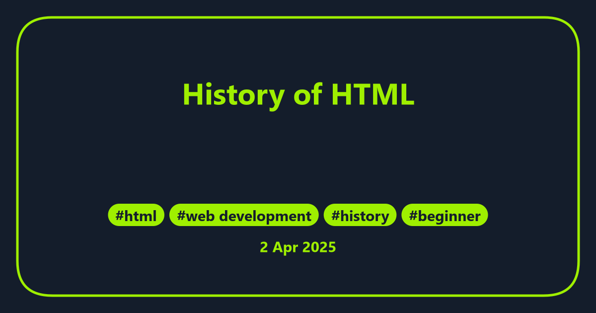

HTML, or HyperText Markup Language, is the backbone of the web. It’s the standard language used to create and structure content on the internet. But how did HTML come to be? Let’s take a journey through its history, from its inception to its current role in modern web development.

---

## The Birth of HTML (1989-1991)

HTML was created by **Sir Tim Berners-Lee**, a British computer scientist, while working at **CERN** (the European Organization for Nuclear Research). In 1989, Berners-Lee proposed a system to share and manage information among researchers. This system would later become the **World Wide Web**.

The first version of HTML was a simple markup language designed to structure scientific documents. It included basic tags like `
` for paragraphs, `<h1>` for headings, and `<a>` for hyperlinks. The first official specification, **HTML 1.0**, was released in 1991.

---

## HTML 2.0: Standardization Begins (1995)

As the web grew in popularity, the need for standardization became apparent. In 1995, the **Internet Engineering Task Force (IETF)** released **HTML 2.0**, the first standardized version of HTML. This version introduced forms, allowing users to interact with web pages by submitting data.

---

## HTML 3.2 and 4.0: The Rise of Tables and CSS (1997-1999)

By the late 1990s, the web was evolving rapidly. **HTML 3.2**, released in 1997, introduced support for tables, which allowed developers to create more complex layouts. However, tables were often misused for page layout, leading to cluttered and hard-to-maintain code.

In 1999, **HTML 4.01** was released, bringing significant improvements. It emphasized the separation of content and presentation by encouraging the use of **Cascading Style Sheets (CSS)** for styling. This version also introduced new elements like `
` and ``, which became essential for modern web design.

---

## XHTML: A Failed Experiment (2000-2009)

In 2000, **XHTML 1.0** was introduced as a stricter and more XML-based version of HTML. While it aimed to improve code quality and interoperability, its strict syntax rules made it difficult for developers to adopt. By the late 2000s, XHTML had largely fallen out of favor.

---

## HTML5: The Modern Era (2014-Present)

The release of **HTML5** in 2014 marked a new era for web development. HTML5 introduced a wealth of new features, including:

- Semantic elements like `<header>`, `<footer>`, and `<article>` for better document structure.
- Native support for multimedia with `<audio>` and `<video>` tags.
- APIs for offline storage, drag-and-drop, and geolocation.
- Improved accessibility and support for mobile devices.

HTML5 is now the standard for modern web development, enabling developers to create rich, interactive, and responsive websites.

---

## The Future of HTML

HTML continues to evolve with the needs of the web. The **World Wide Web Consortium (W3C)** and the **Web Hypertext Application Technology Working Group (WHATWG)** are actively working on new features and improvements. As technologies like **WebAssembly** and **Progressive Web Apps (PWAs)** gain traction, HTML remains a foundational technology for the web.

---

## Conclusion

From its humble beginnings as a tool for sharing scientific documents to its current role as the foundation of the modern web, HTML has come a long way. Its evolution reflects the growth of the internet itself, and its future promises even more exciting possibilities. Whether you’re a beginner or an experienced developer, understanding HTML’s history is key to appreciating its importance in web development.

---

### Further Reading
- [W3C HTML Specification](https://www.w3.org/TR/html/)
- [MDN Web Docs: HTML](https://developer.mozilla.org/en-US/docs/Web/HTML)
- [Tim Berners-Lee’s Original Proposal for the Web](https://www.w3.org/History/1989/proposal.html)